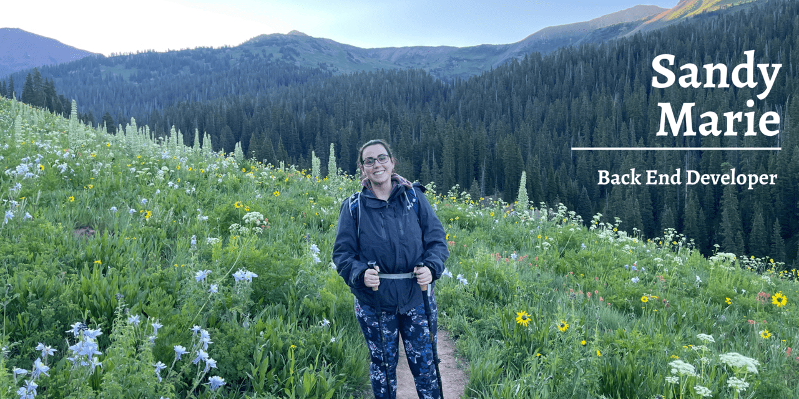

### 👋🏼 Hey there, I'm Sandy! 

#### After working in Customer Service for over 12 years and Healthcare for over 8 years I decided to follow my passions in tech and become a software developer. I've been working on coding projects since 2020 starting with `C++` and moving my way into back end development with a focus on `TDD` with `Ruby on Rails` and `API creation/consumption`. I love to binge video games in my off time so I feel incredibly fulfilled with problem solving which makes coding such a stimulating career. I constantly strive to improve my skills and knowledge so follow to see all the projects I'm working on now and in the future!

